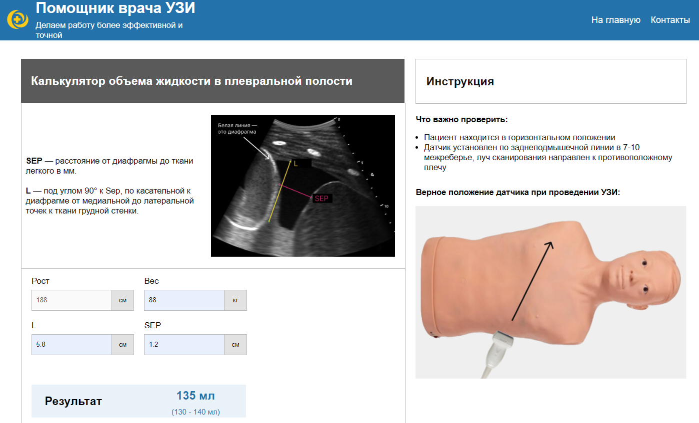
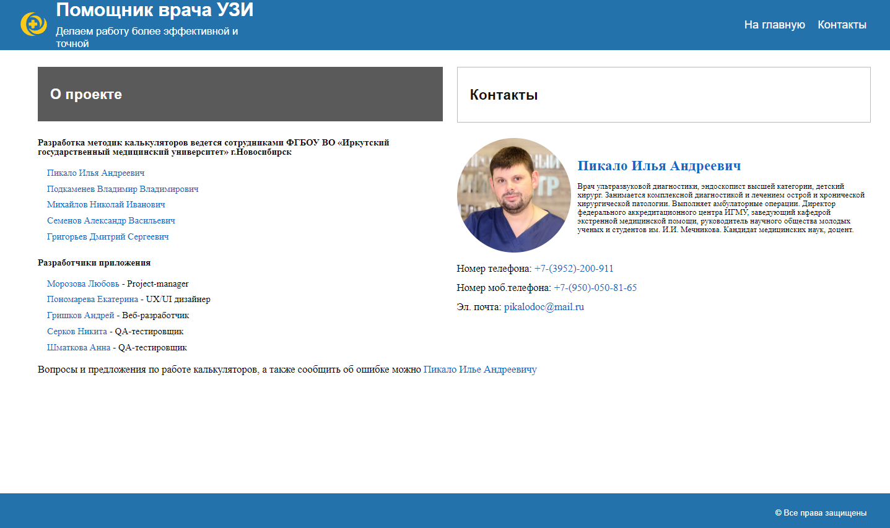

##Ultrasound-helper
___

### 🩺 Ссылка на проект:

* [Деплой проекта "Помощник врача УЗИ"](https://ultrasound-helper.vercel.app/) 
___

### 💉 О проекте "Ultrasound helper"

Проект "Помощник врача УЗИ" разрабатывался для использования врачами ультразвуковой 
диагностики города Иркутск на основе методик, разработанных сотрудниками 
ФГБОУ ВО «Иркутский государственный медицинский университет».
Приложение представляет набор медицинских калькуляторов для вычисления показателей здоровья
пациентов на основе данных, получаемых при ультразвуковой диагностике.


*Калькулятор*

На текущий момент разработан калькулятор вычисления объема жидкости в плевральной полости.
Другие калькуляторы планируются добавлять по мере получения патентов. 
___

### 🩻 О работе над созданием сайта "Помощник врача УЗИ"

Идею создания сайта с медицинскими калькуляторами предложил врач ультразвуковой диагностики
Пикало Илья Андреевич, являющийся автором методики вычисления объема жидкости в плевральной полости.
Для организационных работ и сбора команды в роли Project-manager выступила врач-лечебник
Морозова Любовь.
Из-за нехватки времени на координацию проекта, из-за выхода из команды
UX/UI дизайнера, сдвига сроков получения патентов на другие методики - проект было решено заморозить.
В текущем виде сайт применяется в тестовом режиме преподавателями и студентами Иркутского 
государственного медицинского университета.
На момент завершения проекта была сверстана по макету десктопная версия.
Реализована страница выбора калькуляторов, калькулятор вычисления объема жидкости в плевральной полости,
страница с контактами участников проекта.
Параллельно разработке сайта изучалась технология Redux, которая была закреплена при разработке страницы с контактами.


*Контакты участников проекта*
___

### ⚕️ Планы по развитию проекта:
* Добавить другие медицинские калькуляторы.
* Переработать дизайн, сделать версии под мобильное и планшетное разрешение.
* Провести тестирование и устранить баги
* Сделать мобильную версию приложения с загрузкой в google play.
___

### 🔬 Технологии
*Html, SCSS, BEM, Git, React, Redux*


### 🫀 Инструкция по запуску на локальной машине:
* Установить [Node.js](https://nodejs.org/ru/)
* Клонировать репозиторий ``` git clone 'ссылка на репозиторий'```
* Установить зависимости ``` npm install ```
* Запустить приложение ``` npm run start ```
